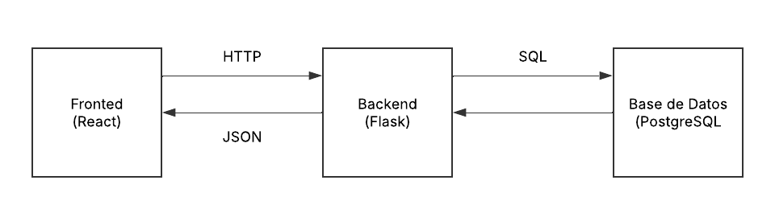

# Arquitectura del Sistema

## Descripción General
La aplicación utiliza una arquitectura **cliente-servidor** para la gestión de riesgos de ciberseguridad. Este diseño separa el frontend (cliente) del backend (servidor), facilitando modularidad y mantenimiento. La comunicación entre ambos se realiza mediante una API RESTful, garantizando simplicidad e interoperabilidad.

### Componentes
- **Frontend**: ReactJS  
- **Backend**: Python con Flask  
- **Base de datos**: PostgreSQL  

## Base de Datos  
La aplicación utiliza una base de datos **PostgreSQL** con la siguiente estructura:

| Campo        | Tipo de Dato    | Restricciones                                              | Descripción                        |
|-------------|---------------|------------------------------------------------------------|------------------------------------|
| `id`        | SERIAL        | PRIMARY KEY                                               | Identificador único del riesgo.    |
| `title`     | VARCHAR(100)  | NOT NULL                                                  | Título del riesgo.                 |
| `description` | TEXT          | Ninguna                                                   | Descripción detallada del riesgo.  |
| `impact`    | INTEGER       | NOT NULL, CHECK (impact BETWEEN 1 AND 5)                   | Nivel de impacto (1-5).           |
| `probability` | INTEGER       | NOT NULL, CHECK (probability BETWEEN 1 AND 5)             | Nivel de probabilidad (1-5).      |
| `category`  | VARCHAR(50)   | Ninguna                                                   | Categoría del riesgo.             |
| `status`    | VARCHAR(20)   | NOT NULL                                                  | Estado actual del riesgo.         |

### Flujo de Datos
El usuario interactúa con el frontend en un navegador, que envía solicitudes HTTP al backend. El backend procesa estas solicitudes, consulta la base de datos PostgreSQL y devuelve respuestas en formato JSON, las cuales el frontend renderiza para el usuario.

## Decisiones de Diseño  

1. **Uso de Flask sin ORM**  
   - Se decidió **no utilizar un ORM** como SQLAlchemy porque, al ser un proyecto pequeño, no era necesario.  
   - Las consultas SQL se escriben manualmente para un mayor control y optimización del rendimiento.  
   - Se implementaron medidas para proteger las consultas contra **inyección SQL (SQLi)**, asegurando la seguridad del sistema.  

2. **Paginación en el backend**  
   - Se implementó paginación para limitar la cantidad de resultados enviados en cada solicitud, mejorando el rendimiento del sistema.  
   - Se devuelve un número limitado de registros por página cuando hay más de 10 entradas.  

3. **Estrategia de carga de componentes en el frontend**  
   - React permite dividir la interfaz en componentes reutilizables y optimizados.  
   - Se evita la carga innecesaria de datos manejando estados de manera eficiente.  

4. **Búsqueda sin botón de acción**  
   - Se decidió **no incluir un botón de búsqueda** en el frontend porque así la interacción se siente más fluida.  
   - Cada vez que el usuario teclea, se envía una petición automáticamente al backend, asegurando una búsqueda en tiempo real.  
   - Este enfoque fue elegido considerando que es una prueba técnica, priorizando una experiencia más dinámica y sin fricciones para el usuario.  
